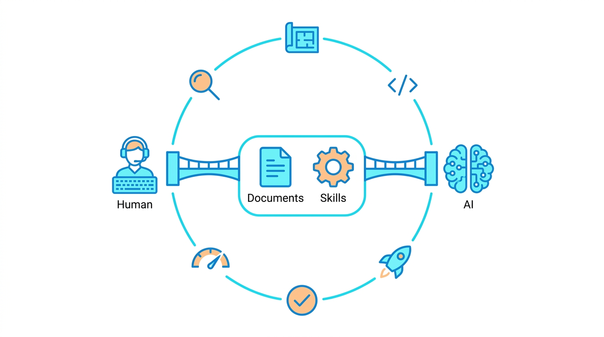
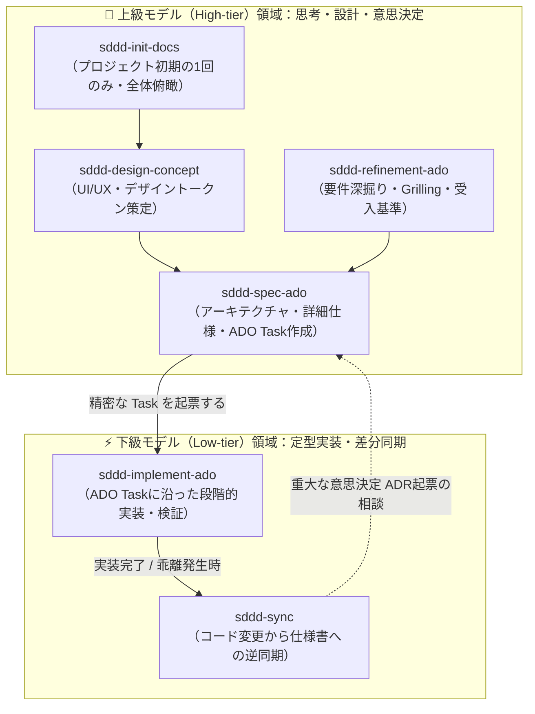
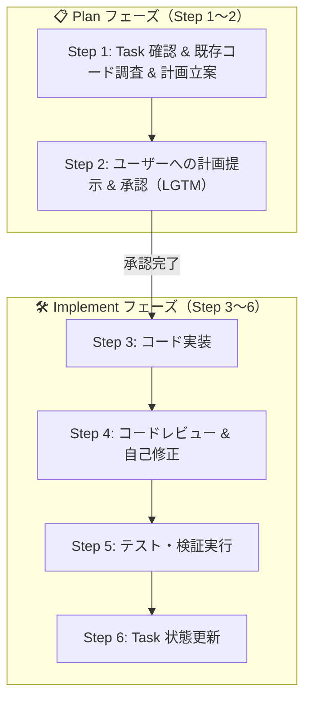
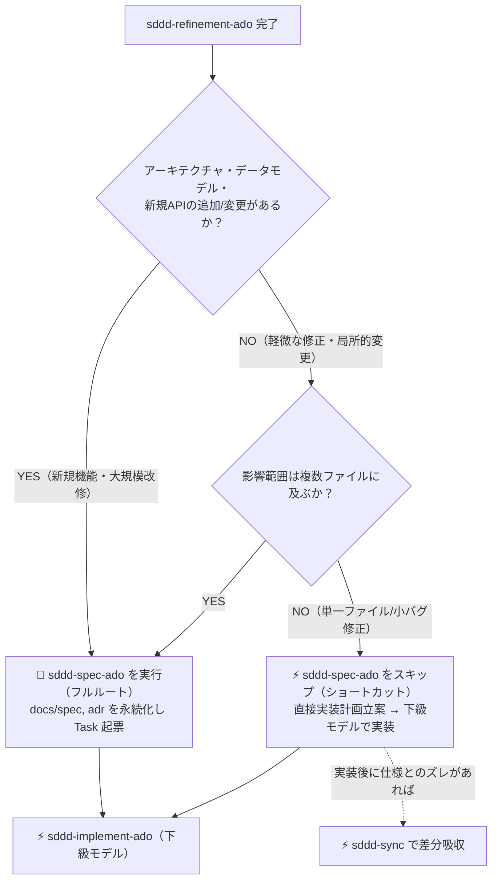

# SDDD Harness 🛠️

Skillsとドキュメントを共通言語に、人とAIの協調開発を支える『スキル・ドキュメント駆動開発（Skill-Doc Driven Development）』の軽量ハーネス



### SDDDを支える2つの柱 🏛️

- **Documents（ドキュメント）**: プロジェクトの「Single Source of Truth（単一の真実の情報源）」。AIと人間が仕様や設計のコンテキストを共有し、ブレなく開発を進めるための指針となる。
- **Skills（スキル）**: 開発プロセスの「Executable Runbook（実行可能な手順書）」。要件定義から実装、ドキュメント同期まで、各工程におけるAIの動きを制御する軽量ハーネスとして機能し、高品質なアウトプットを安定して引き出す。

## Skills概要 📖

### sddd-init-docs 🏗️

既存プロジェクトからSDDD用のドキュメント（`docs/spec/`、`docs/adr/`）を一括初期生成するSkills。

### sddd-design-concept 🎨

デザインコンセプトを明確にするためのSkills。

### sddd-refinement-ado 🎯

Azure DevOpsのワークアイテムを明確にするためのSkills。

### sddd-spec-ado 📐

Azure DevOpsのワークアイテムを基に設計を行うSkills。
この時点では設計草案として出力する。

### sddd-implement-ado 💻

設計草案とAzure DevOps Taskを基に実装を行うSkills。
実装後に設計草案を設計書に反映する。

### sddd-sync 🔄

ワンショットで実装したコードを設計に反映するSkills。

## フォルダ構成 📁

Skillsによって生成されるフォルダ構成例。

```
docs/
  proposals/
    pbi-123.md (設計草案/Blueprint)
  spec/
    features.md
    data-models.md
    system-architecture.md
  adr/
    001-ui-ux-原則.md
    002-state-management-原則.md
    ...
  design/
    concept.md
    tokens.md
```

## 依存Skills・MCP 🔌
- [grill-with-docs](https://github.com/mattpocock/skills/blob/main/docs/engineering/grill-with-docs.md)
- [grilling](https://github.com/mattpocock/skills/blob/main/docs/productivity/grilling.md)
- [Azure DevOps MCP](https://github.com/microsoft/azure-devops-mcp)

## モデル最適配分戦略 🚀

スキル＆ドキュメント駆動開発（SDDD）において**「思考・設計（Plan）は上級モデル、実行（Run）は下級モデル」**の原則を適用し、トークン消費を劇的に抑えつつ開発精度を最大化するためのモデル使い分け戦略をまとめる。

### 1. モデル配分ワークフロー 🗺️

上級モデル（High-tier: 推論・抽象化・対話）と下級モデル（Low-tier: 定型実行・コード生成・検証）の境界線を示したワークフロー。



### 2. 各スキルの推奨モデル配分一覧 📊

| スキル名 | 推奨モデル | 頻度 | トークン節約の視点と理由 |
| :--- | :---: | :---: | :--- |
| **`sddd-init-docs`** | **上級** 👑 | 極低（初回1回） | コード全体を俯瞰して「適切な抽象度の仕様書」へ落とし込む高い要約力が必要。**1度きりの実行**なのでケチらず上級で高品質な土台を作るのが吉。 |
| **`sddd-design-concept`** | **上級** 👑 | 低（初期/改修時） | 抽象的な世界観・UX思想を対話（Grilling）で引き出し、破綻のないトークン体系に落とし込む高度な推論力が必要。 |
| **`sddd-refinement-ado`** | **上級** 👑 | 中（PBIごと） | ユーザーの暗黙の前提を崩す「鋭い推論ツリー（Grilling）」と「筋の良い推奨解」の提示が命。ここで妥協すると手戻りコストが激増する。 |
| **`sddd-spec-ado`** | **上級** 👑 | 中（PBIごと） | **Planの中核！** 既存仕様・ADR・デザインを横断統合し、「下級モデルが迷わず実装できる精密なロードマップ」を作る。ここを上級にするからこそ下流で節約できる。 |
| **`sddd-implement-ado`** | **下級** ⚡ | **極高（日常）** | **最大のトークン削減ポイント！** Task に目的・ファイル・参照仕様・テストコマンドが明記されているため、下級モデルのコード生成＋テスト自己修復で十分回る。 |
| **`sddd-sync`** | **下級〜中級** ⚡ | 高（日常） | Git diffから変更箇所（型・API・画面）を抽出し、既存ドキュメントのフォーマットにマッピングして追記する定型作業が主。下級モデルで十分こなせる。 |

### 3. コスト削減を最大化する運用のコツ 💡

> [!TIP]
> **「下級モデルが迷わない Task」を上級モデルに書かせる**
> `sddd-spec-ado` で起票される Task に以下の4点が揃っているほど、`sddd-implement-ado` で下級モデルを使っても失敗しません：
> 1. 変更対象ファイルの一覧
> 2. 参照すべき仕様（型名、API名）
> 3. 具体的な実装方針
> 4. 検証コマンド（`npm test`, `lint` 等）

> [!IMPORTANT]
> **下級モデルの「3ストライクルール」（エスカレーション）**
> `sddd-implement-ado` で下級モデルがテストエラーやコンパイルエラーを解決できず、**2〜3往復ループしたら即座に上級モデルに切り替える**こと。
> 下級モデルの泥沼デバッグは最もトークンを無駄遣いするため、「詰まったら即上級」が鉄則です。

### 4. `sddd-implement-ado` 内部での Plan/Implement モデル分割戦略 🔍

`sddd-implement-ado` はスキル内部が **Plan（計画・承認）** と **Implement（実装・検証）** に分かれている。ここをモデル分割すべきかの判断基準。



#### パターン別おすすめ運用 🎯

| ステップの性質 | Plan（Step 1〜2） | Implement（Step 3〜6） | 運用の理由とメリット |
| :--- | :---: | :---: | :--- |
| **A. 通常のステップ**<br/>（定型CRUD、単一画面UI、既存パターンの拡張） | **下級** ⚡ | **下級** ⚡ | **【推奨】通しで下級！**<br/>`sddd-spec-ado`（上級）のTaskが詳細なため、下級モデルでも十分高精度なPlanが出せる。途中でモデルを切り替える操作コスト（手間）も削減。 |
| **B. 難関ステップ**<br/>（複雑な状態管理、複数モジュール連携、非自明なアルゴリズム） | **上級** 👑 | **下級** ⚡ | **【超効果的！】**<br/>既存コードの読み込みと精密な変更行計画は上級モデルに解かせ、承認された「完璧なPlan」をプロンプトに残した状態で下級モデルへスイッチして実装させる。 |
| **C. デバッグ・復旧時**<br/>（下級モデルがテストをパスできず詰まった時） | - | **上級に緊急切替** 👑 | 下級モデルが2〜3回ループしたら、手動で上級モデルに切り替えてエラーを即座に解決させる（3ストライクルール）。 |

### 5. `sddd-spec-ado`（設計フェーズ）のスキップ判断基準 ⚖️

`sddd-refinement-ado` の後、**`sddd-spec-ado` を挟むフルルート** と **直接実装計画を立てるショートカットルート** のどちらを選ぶべきかの分岐フロー。



#### フルルート vs ショートカットルートの比較 🧭

| 観点 | `sddd-spec-ado` を挟む（フルルート） 👑 | `sddd-spec-ado` をスキップ（ショートカット） ⚡ |
| :--- | :--- | :--- |
| **単発タスクのトークン** | やや多い（設計・ドキュメント更新分） | **少ない**（直接実装に進むため） |
| **中長期プロジェクト全体のトークン** | **圧倒的に少ない**（仕様書によるコンテキスト圧縮が効く） | 次第に増加（仕様書が陳腐化し、毎回全コード探索になる） |
| **下級モデルの実装成功率** | **極めて高い**（型・API・検証コマンドが確定しているため） | 中〜低（抽象的な受入基準からコードを書くため迷走しやすい） |
| **ドキュメントの鮮度** | 常に最新（Single Source of Truth） | コードとドキュメントが乖離（ドリフト）しやすい |
| **適したタスク** | **Feature新規開発、DB/型変更、API新設** | **軽微なバグ修正（Hotfix）、文言・スタイル微修正** |

